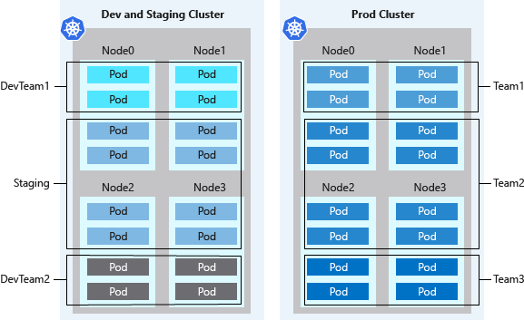
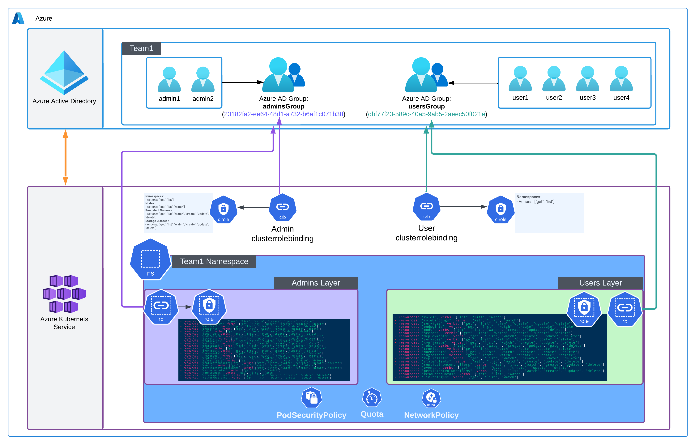

# AKS-Multi-tenant-implementation

## About the repo
This repository has files to implement a end to end kubernetes(AKS) multi-tenant architecture in your organisation in Azure, where each tenant(teams or applications) will be provisioned with 'Namespace' basically a logical separation in k8s which helps in attaining multi-tenancy easily.

  

## Design clusters for multi-tenancy
Kubernetes lets you logically isolate teams and workloads in the same cluster. The goal is to provide the least number of privileges scoped to the resources each team needs. A Kubernetes Namespace creates a logical isolation boundary. Other Kubernetes features and considerations for isolation and multi-tenancy include the following areas:

Design clusters for multi-tenancy:
- Scheduling
- Networking
- Authentication and authorization
- Containers

### Scheduling
Scheduling uses basic features like resource quotas and pod disruption budgets.

More advanced scheduler features include:
- Taints and tolerations.
- Node selectors.
- Node and pod affinity or anti-affinity.

### Networking
Networking uses network policies to control the flow of traffic in and out of pods.

### Authentication and authorization
Authentication and authorization uses:
- Role-based access control (RBAC).
- Azure Active Directory (AD) integration.
- Pod identities.
- Secrets in Azure Key Vault.

### Containers
Containers include:
- The Azure Policy add-on for AKS to enforce pod security.
- Pod security admission.
- Scanning images and runtime for vulnerabilities.
- Using App Armor or Seccomp (Secure Computing) to restrict container access to the underlying node.

## Implementing The project
This project is about creating multi-tenant-implementation for Azure AKS service.

For each tanant there will be 2 groups:
- usersGroup
- adminsGroup

This groups are created and managed by Azure AD and implemented to AKS by enabling Azure AD integration in AKS and applying this repo YAMLs for each namespaces and groups

### Project Architecture

  

### Starting the Project
You will need to provide:
- usersGroup ID
- adminsGroup ID
- namespace name

change them in YAMLs manifests and apply them using Azure portal in AKS service

## References

[Official Microsoft Docs about multi-tanant-AKS](https://learn.microsoft.com/en-us/azure/aks/operator-best-practices-cluster-isolation)
